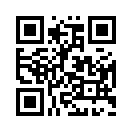

# QR Code(Quick Response Code) Implement by Go
The QRCode Generator, Micro QRCode Generator, QRCode Decoder, Micro QRCode Decoder application.
> According to ISO/IEC 18004-2015 Standard  
> 

## Installation
```
go get -u github.com/KangSpace/gqrcode
```

Dependencies Package:

1. imaging
> go get -u github.com/disintegration/imaging

2. image
> mkdir $GOPATH/golang.org/x/    
> cd $GOPATH/golang.org/x/  
> git clone https://github.com/golang/image.git

3. text
> cd $GOPATH/golang.org/x/  
> git clone https://github.com/golang/text.git


## Usage
#### QR Code

QRCode supports 4 character modes, and 40 versions with 4 Error correction levels.

Micro QRCode supports 4 character modes, and 4 versions with 4 Error correction levels.

4 Modes: 
* numeric  
  characters(10): 0 - 9  
  
  maximum characters in Version 40-L: 7089 characters.
  
* alphanumeric  
  characters(45): 0 - 9, A - Z, SP, $, %, *, +, -, ., /, :  

  maximum characters in Version 40-L: 4296 characters.
  
  > Alphanumeric mode is not available in Version M1 Micro QR Code Symbol

* byte  
  8-bit characters.  

  maximum characters in Version 40-L: 2953 characters.

  > Byte mode is not available in Version M1 or M2 Micro QR Code Symbol.
   
* kanji  
  Kanji characters in accordance with the Shift JIS system based on JIS X 0209.
  Only use for double-byte characters, Range are: \x8140-\x9FFC and \xE040-\xEBBF.

  maximum characters in Version 40-L: 2953 characters.

  > Kanji mode is not available in Version M1 Or M2 Micro QR Code Symbol.


4 Error correction level:
Four levels of Reed-Solomon error correction(referred to as L, M, Q and H in increasing order of capacity)
allowing recover of:

- L 7%
- M 15%
- Q 25%
- H 30%
    > Micro QR Code is not support H level.

##### Create QR Code
```
    // create a numeric qrcode
    data := "0123456"
    qrcode, err := NewQRCode(data)   
    outFileName := "/opt/temp/numeric.png"
    if err == nil{
        out := output.NewPNGOutput0()
        qrcode.Encode(out,outFileName)
    }
    
    // create a numeric micro qrcode
    micQrcode, err := NewMicroQRCode(data)   
    outFileName2 := "/opt/temp/numeric_micro.png"
    if err == nil{
        out2 := output.NewPNGOutput0()
        micQrcode.Encode(out2,outFileName2)
    }
```


* [NewQRCode(content string) (*mode.QRCodeStruct,error)](qrcode.go)  
  
  Create a new QRCode(Model2) by input data.   
  There will be auto-detected the Version, Error Correction Level, and without Quiet Zone.

  e.g.:   
  


* [NewQRCodeAutoQuiet(content string) (*mode.QRCodeStruct,error)](qrcode.go)   
  
  Create a new QRCode(Model2) by input data with auto-size Quiet Zone, default is 4x modules per side.
  
  e.g.:  
  


* [NewMicroQRCode(content string) (*mode.QRCodeStruct,error)](qrcode.go)

  Create a new Micro QRCode by input data.
  
  e.g.:  
  
  

* [NewMicroQRCodeAutoQuiet(content string) (*mode.QRCodeStruct,error)](qrcode.go)

  Create a new Micro QRCode by input data with auto-size Quiet Zone, default is 2x modules per side.
  
  e.g.:  
  

* [NewQRCode0(content string,format cons.Format,ec *mode.ErrorCorrection,m mode.Mode,quietZone *model.QuietZone) (qr *mode.QRCodeStruct,err error)](qrcode.go)

  Create a new QRCode by input data with full parameters.  

    **Params**:

    |  Parameter | Type | Values  | Comments |
    |  ----  | ---- | ----  | ----|
    | content  | string | numeric,alphanumeric,and other strings |-|
    | format  | [cons.Format](core/cons/constant.go) | cons.QRCODE,cons.QrcodeModel2,cons.MicroQrcode | cons.QRCODE same with cons.QrcodeModel2|
    | ec   | [*mode.ErrorCorrection](core/mode/errorcorrection.go) | NewErrorCorrection(level) | level in (cons.L,cons.M,cons.Q,cons.H)|
    | m   | [mode.Mode](core/mode/mode.go) | NewNumericMode(),NewAlphanumericMode(),NewKanjiModeMode(),	NewByteModeMode() | - |
    | quietZone   | [*model.QuietZone](core/model/quietzone.go) | model.AutoQuietZone,model.NoneQuietZone,NewQuietZone(size int)| - |


###### Encode QR Code

```
   out := output.NewPNGOutput0()
   qrcode.Encode(out,outFileName)
```
* [(qr *QRCodeStruct) Encode(out output.Output,fileName string) (err error)](core/mode/qrcodestruct.go)  

  Encode the QRCode/Micro QRCode to the specified file and output.


* [(qr *QRCodeStruct) EncodeToBase64(out output.Output) (base64Str string,err error)](core/mode/qrcodestruct.go)  

  Encode the QRCode/Micro QRCode to Base64 URL String(like data:image/png,base64,xxxx) and output.
    
**Encode Params**:

|  Parameter | Type | Values  | Comments |
|  ----  | ---- | ----  | ----|
| out  | [output.Output](core/output/output.go) | NewPNGOutput(size int), NewPNGOutput0(), NewJPGOutput(size int), NewJPGOutput0(), NewGIFOutput(size int), NewGIFOutput0() |Newxxx0() output with auto-size for image.|
| fileName  | string | output file path | - |

###### Output QRCode

   [output.ImageOutput](core/output/image_output.go) implements [output.Output](core/output/output.go) interface to output PNG,JPG,GIF image.
  ```
      out := output.NewPNGOutput(100)
      out = output.NewPNGOutput0()
    
      logoImageFilePath := "logo.png"
      // add logo image into QRCode
      out.AddOption(output.LogoOption(logoImageFilePath))
  ```

**Output Params**:  

  |  Parameter | Type | Values  | Comments |
  |  ----  | ---- | ----  | ---- |
  | size  | int | the image size for output| - |


#### Test QR Code

All QRCode test in [qrcode_test.go](qrcode_test.go) and [micro_qrcode_test.go](micro_qrcode_test.go) files.


#### TODO list

<table>
	<thead>
	    <th>Type</th>
	    <th>Item</th>
	    <th>Done Time</th>  
	</thead >
    <tbody>
        <tr >
            <td rowspan="7">QRCode Model2</td>
            <td>Numeric Mode and test</td>
            <td>2021-05-30 22:47:57</td>
        </tr>
        <tr>
            <td>Alphanumeric Mode</td>
            <td>2021-05-31</td>
        </tr>
        <tr>
            <td>Byte Mode</td>
            <td>2021-05-31</td>
        </tr>
        <tr>
            <td>Kanji Mode</td>
            <td>2021-06-01</td>
        </tr>
        <tr><td>ECI Mode</td>
            <td>NOT-IMPLEMENT</td>
        </tr>
        <tr>
            <td>FNC1 Mode</td>
            <td>NOT-IMPLEMENT</td>
        </tr>
        <tr>
            <td>Mixed Mode</td>
            <td>NOT-IMPLEMENT</td>
        </tr>
        <tr >
            <td >QRCode Model1</td>
            <td>-</td>
            <td>NOT-SUPPORT</td>
        </tr>
        <tr >
            <td >Micro QRCode</td>
            <td>Micro QRCode</td>
            <td>2021-06-07</td>
        </tr>
        <tr >
            <td >
                Personalized QRCode <br>
                <span style="font-size: smaller;">(add logo image at center of QRCode)</span>
            </td>
            <td>-</td>
            <td>2021-06-02</td>
        </tr>
        <tr >
            <td rowspan="3">
                Output
            </td>
            <td>Image File</td>
            <td>2021-05-30</td>
        </tr>
        <tr >
            <td>Base64 String</td>
            <td>2021-06-01</td>
        </tr>
        <tr >
            <td>SVG</td>
            <td>-</td>
        </tr>
        <tr >
            <td rowspan="2">
                Decoder
            </td>
            <td>QRCode</td>
            <td>-</td>
        </tr>
        <tr >
            <td>Micro QRCode</td>
            <td>-</td>
        </tr>
	</tbody>
</table>
