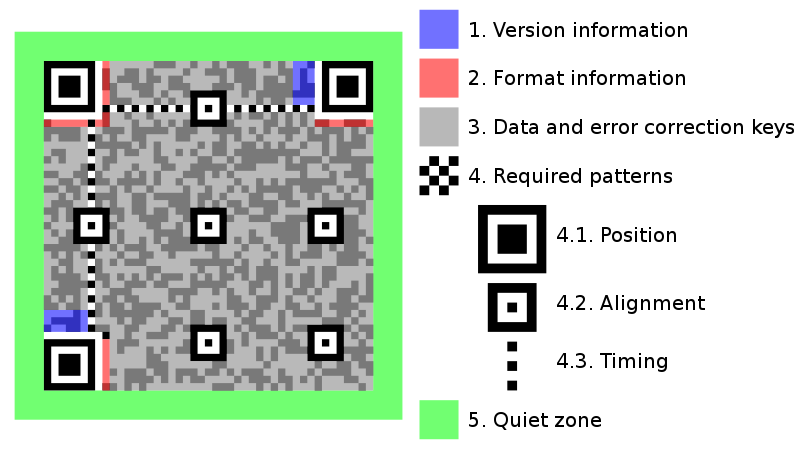

# QR Code(Quick Response Code) Implement by Go
> According to ISO/IEC 18004-2015 Standard  
> (2021-05-17 ~ )

## QRCode Types 
* QRCode   
  > With fall range of capabilities and maximum data capacity.  
  *   QRCode Model1  
      
  *   QRCode Model2  
      
  

  QRCode Struct:  
  
  
  
  
  * Function patterns  
    **Finder pattern**  
    > (Page 24,6.3.3 Finder pattern)  
      There are 3 identical Finder pattern locate at the upper left,upper right and low left corner of the symbol.  
      Each finder pattern may be viewed as 3 superimposed concentric squares:  
        dark 7 x 7 modules  
        light 5 x 5 modules  
        dark 3 x 3 modules.  
      The ratio of module widths in each finder pattern is 1:1:3:1:1.  
      
    
    **Separator**  
    > A one-module wide separator, constructed of all light modules,is placed between each finder pattern and the Encoding Region.  
    
    **Timing pattern**  
    > The horizontal and vertical timing patterns respectively consist of a one module wide row or column of alternating dark and light modules,  
      commencing and ending with a dark module.  
      They enable the symbol density and version to be determined and provide datum positions for determining module coordinates.
    
    > In QR Code symbols,`the horizontal` timing pattern runs across _`row 6`_ of the symbol between _`the separators for the upper finder patterns`_;  
      `the vertical` timing pattern similarly runs down _`column 6`_ of the symbol between `the separators for the left-hand finder patterns`.  
      See Figure 3;

    > In Micro QR Code symbols, `the horizontal` timing pattern runs across `row 0 `of the symbol on the `right side of the separator to the right-hand edge `of the symbol;  
      `the vertical` timing pattern similarly runs down` column 0 `of the symbol below the `separator to the bottom edge` of the symbol.  
      See Figure 4;    

    **Alignment pattern**
    > Alignment patterns are present `only in QR Code symbol of version 2 or larger`.  
      Each alignment pattern my be viewd as three superimposed concentric squares and is constructed of:  
      dark 5 x 5 modules  
      light 3 x 3 modules
      single central dark module  
      The number of alignment patterns depend on the symbol version.
    
  * Encoding region  
    
    **Format information**  
    
    **Version information**
    **Data and error correction codewords**
    
  * Quiet Zone(minimum:4x)

* Micro QRCode  
  > With reduce overhead,some restrictions on capabilities and reduce data capacity(compared with QR Code symbol)
    
  
  
  Micro QRCode Struct:  
    
  
  **Finder pattern**  
    > A single finder pattern, as defined [QRCode]  
  
  **Separator**  
  **Timing pattern**  
  **Format information**  
  **Encoding region**  
  **Quiet zone**(minimum:2x)  

## Encode procedure overview steps:  
(Page 26. Encode procedure overview)
1. Data analysis  
   Determine the smallest version or specified version for ues.  
   Mode select strategy by Page 107(PDF) optimisation of bit stream length.
      
   
   
   
2. Data encoding  
   Convert the data characters `into a bit stream in accordance with the rules for the mode in force`, as defined in 7.4.2 to 7.4.6,
   inserting mode indicators as necessary to change modes at the beginning of each new mode segment,
   and a Terminator at the end of the data sequence.  
   **Split the resulting bit stream into `8-bit codewords`**(data codeword).  
   Add Pad Characters as necessary to fill the number of data codewords required for the version.
   
   `Mode Indicator Bits + Data Bits + Terminal Bits + Padding Bits(to full version bits count)`  
   The ECI header(if present) shall comprise:  
    --- ECI Mode Indicator(4 bits)  
    --- ECI Designator(8,16 or 24 bits)    
   The ECI header shall begin with the first(most significant)bit of the ECI mode indicator and end with the final(least significant) bit of the ECI Designator.  
   The remainder of the bit stream is then made up of segments each comprising:  
   --- Mode indicator  
   --- Character count indicator  
   --- Data bit stream  
   Each mode segment shall begin with the first(most significant) bit of the mode indicator and end with the final(least significant) bit of the data bit stream.  
   There shall be no explicit separator between segments as their length is defined unambiguously by the rules for the mode in force and the number of input data characters.  
   
     
   **The end of the data in the complete symbol is indicated by a Terminator consisting of `between 3 and 9 zero bits(see Table2)`,
   which is omitted or abbreviated if the remaining symbol capacity after the data bit stream is less than the required bit length of Terminator.  
   The Terminator is not a mode indicator as such.**

3. Error correction encoding  
   Divide the codeword(2. Data encoding resulting codewords) sequence into the required number of blocks(as defined in Table9) to enable the error correction algorithms to be processed.  
   `Generate the error correction codewords for each block,appending the error correction codewords to the end of the data codeword sequence.`   
   
4. Structure final message  
   Interleave the data and error correction codewords from each block as described in 7.6(step3) and add remainder bits as necessary.
   
5. Module placement in matrix  
   Place the codeword modules in the matrix together with the finder pattern,separators,timing pattern,and (if required) alignment patterns.    
   Page 54,7.7 Codeword placement in matrix  
   7.7.1 Symbol Character representation  
   > There are two types of symbol character,regular an irregular,in the QR Code symbol.  
     Their use depends on their position in the symbol,relative to other symbol characters and function patterns.  
   
   > Most codewords shall be represented in `regular 2 x 4 module block in the symbol`.  
     There are two ways of positioning these blocks,  
     in a vertical arrangement (2 modules wide 4 modules high) and,if necessary when placement changes direction,   
     in a horizontal arrangement(4 modules wide and 2 modules high).
   
    > Irregular symbol characters are used when changing direction or in the vicinity of alignment or other function Patterns.
      Examples are shown in Figures 16,17 and 18.

6. Data masking  
   Apply the data masking patterns in turn to the encoding region of the symbol.  
   Evaluate the results and select the pattern which optimizes the dark/light module balance and minimizes the occurrence of undesirable patterns.
   
7. Format and Version Information  
   Generate the format information and (where applicable) the version information and complete the symbol.

## Decode procedure overview steps:
(Page 62. Decode procedure overview)

Process flow:

1. 

## Implement Functions: 

> To implement specified size (width/height) QR Code.

* Encoder(Page 12-)  
  to JPG, PNG, SVG  
  (with outer mark image in center(expect SVG))
* Decoder  
  From JPG, PNG, SVG  
  (Parser multi symbols in one image)

## Implementation order

1. Generate: QRCode Model2  
   Generate and Simple Test QRCode Model2.
2. Generate: QRCode Model1  
   Generate and Simple Test QRCode Model1.
3. Generate: Micro QRCode  
   Generate and Simple Test Micro QRCode.
4. Completion Test  
   Test for Correctness and Performance

## Test:

## Test for Correctness and Performance
> Compare with ZXING in Correctness and Performance(CPU,Memory and Cost time)

## Reference
> 1. ISO IEC 18004-2015.pdf
> 2. QR Code Specification-ISO_IEC_18004-2006.pdf
> 3. https://www.thonky.com/qr-code-tutorial/error-correction-coding
> 4. https://www.jianshu.com/p/36b1ed153524
> 5. https://blog.csdn.net/hhygcy/article/details/4280165
> 6. https://www.cnblogs.com/Imageshop/archive/2013/04/22/3036127.html

## Dependency Package
1. imaging
> go get -u github.com/disintegration/imaging

2. image
> mkdir $GOPATH/golang.org/x/    
> cd $GOPATH/golang.org/x/  
> git clone https://github.com/golang/image.git

3. text
> cd $GOPATH/golang.org/x/  
> git clone https://github.com/golang/text.git  
